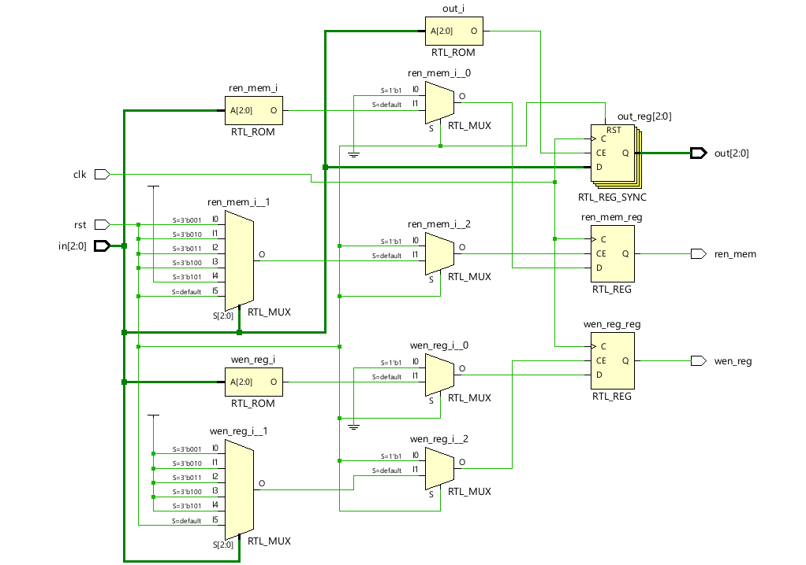
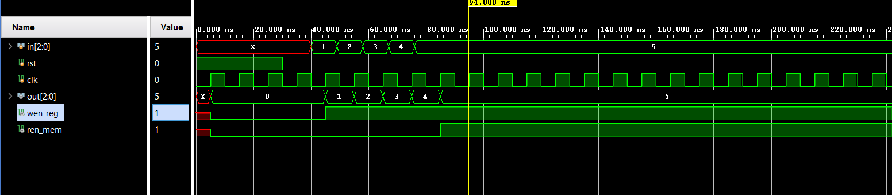

# 📘 Verilog 100 Days – Waveform and Explanation Gallery

This document shows the waveform results and brief explanations of instrction decoder

---

## ✅ Day 62 - instruction decoder

 

**Description:**  
  the scematic of instruction decoder

 

### 🔬 Simulation Result

**Description:**  
simulation results - 
simualtion results of instruction decoder
