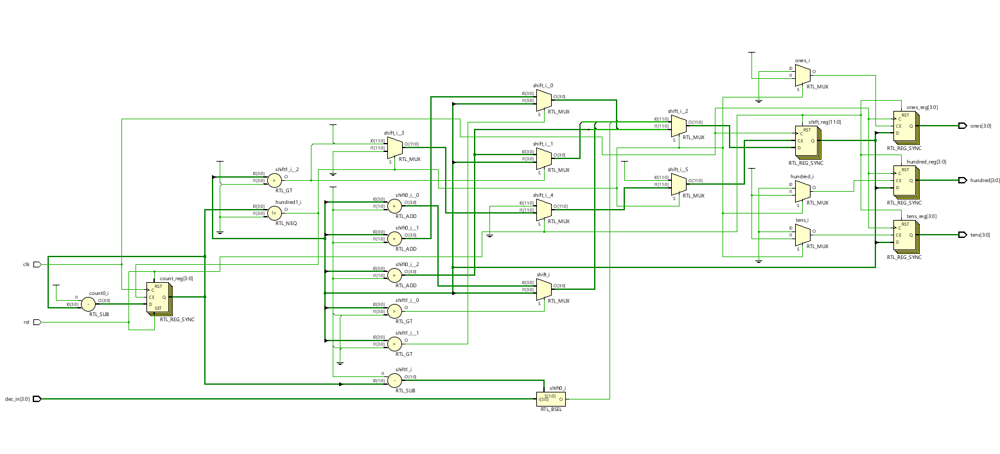
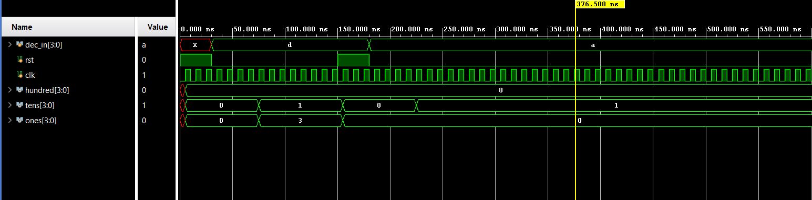

# 📘 Verilog 100 Days – Waveform and Explanation Gallery

This document shows the waveform results and brief explanations of binary to bcd

---

## ✅ Day 63 - binary to bcd
 

**Description:**  
  the scematic of binary to bcd

### 🔬 Simulation Result

**Description:**  
simulation results - 
simualtion results of binary to bcd
