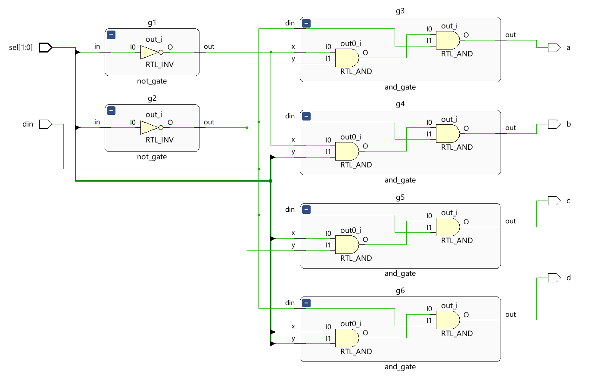

# 📘 Verilog 100 Days – Waveform and Explanation Gallery

This document shows the waveform results and brief explanations of  DEMUX USING GATES

---

## ✅ Day 64 - DEMUX USING GATES

 

**Description:**  
  the scematic of DEMUX USING GATES

### 🔬 Simulation Result

**Description:**  
simulation results - 
simualtion results of DEMUX USING GATES
