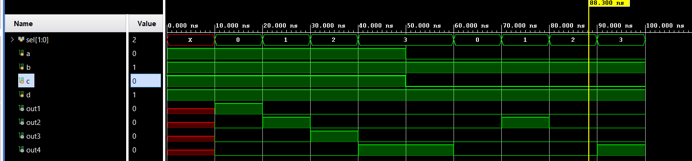

# 📘 Verilog 100 Days – Waveform and Explanation Gallery

This document shows the waveform results and brief explanations of MUX TO DEMUX

---

## ✅ Day 65 - MUX TO DEMUX 

 

**Description:**  
  the scematic of MUX TO DEMUX

 

### 🔬 Simulation Result

**Description:**  
simulation results - 
simualtion results of MUX TO DEMUX
