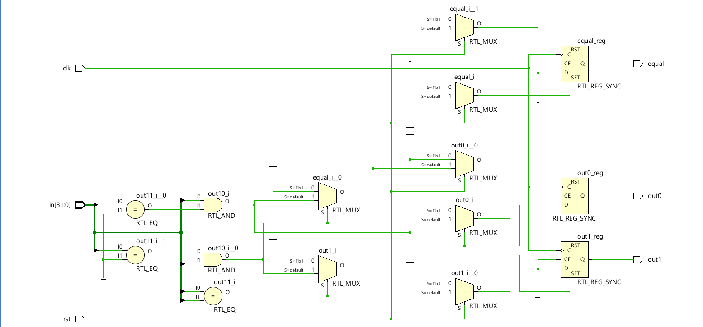
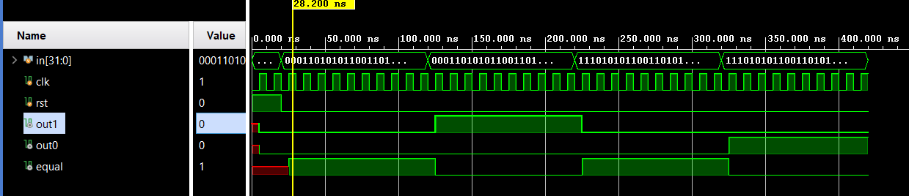

# 📘 Verilog 100 Days – Waveform and Explanation Gallery

This document shows the waveform results and brief explanations of count 1 > 0 and 0 > 1 transition  

---

## ✅ Day 66 - count 1 > 0 and 0 > 1 transition  

 

**Description:**  
 count 1 > 0 and 0 > 1 transition  

 
---

### 🔬 Simulation Result

**Description:**  
simulation results of count 1 > 0 and 0 > 1 transition  
