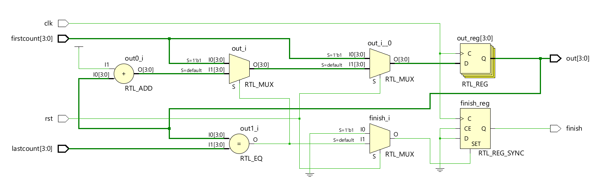

# 📘 Verilog 100 Days – Waveform and Explanation Gallery

This document shows the waveform results and brief explanations of  truncated counter
---

## ✅ Day 67 -  TRUNCATED COUNTER 
 

**Description:**  
  the scematic of  truncated counter

 

### 🔬 Simulation Result

**Description:**  
simulation results - 
simualtion results of truncated counter
