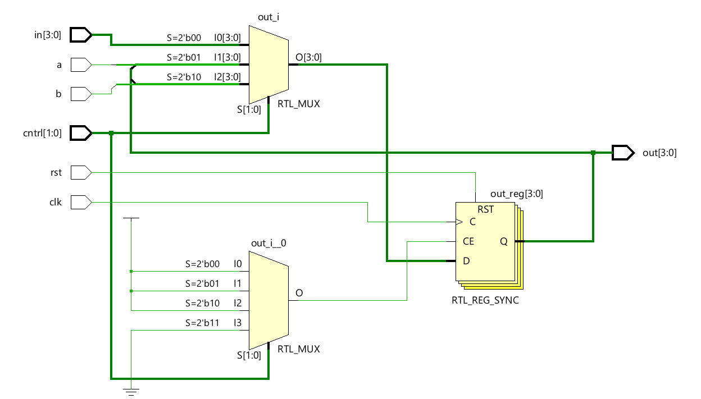
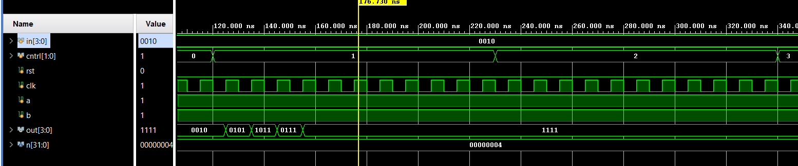

# 📘 Verilog 100 Days – Waveform and Explanation Gallery

This document shows the waveform results and brief explanations of N-BIT-USR

---

## ✅ Day 68 - N-BIT-USR

 

**Description:**  
  the scematic of  N-BIT-USR

 

### 🔬 Simulation Result

**Description:**  
simulation results - 
simualtion results of N-BIT-USR
