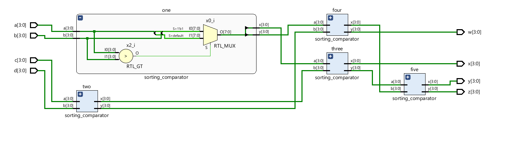
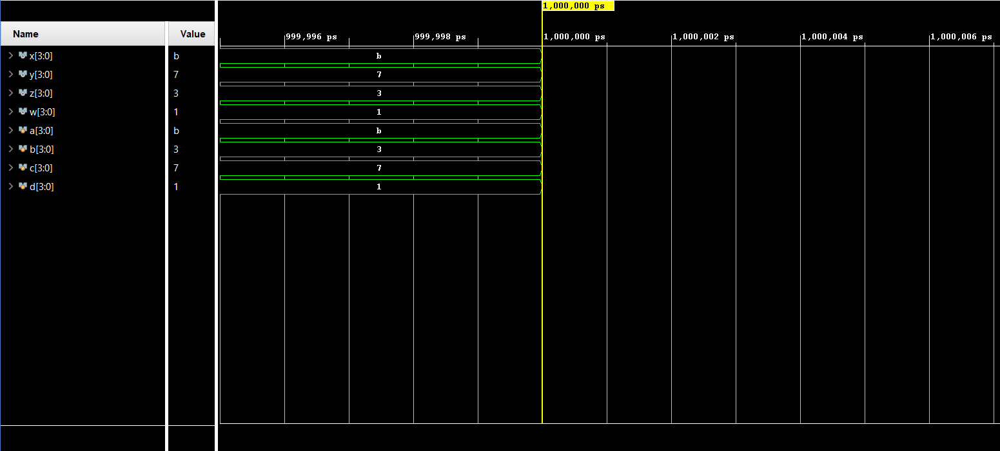

# 📘 Verilog 100 Days – Waveform and Explanation Gallery

This document shows the waveform results and brief explanations of sorting algorithm with using comparator.

---

## ✅ Day 07 - sorting algorithm with using comparator.(ascending order)

 

**Description:**  
  the scematic of sorting algorithm with comparator module.

### 🔬 Simulation Result

**Description:**  
simulation results.
simualtion results of  sorting algorithm with output sorted in ascending order.
