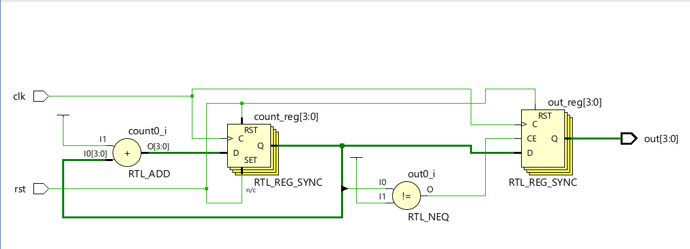
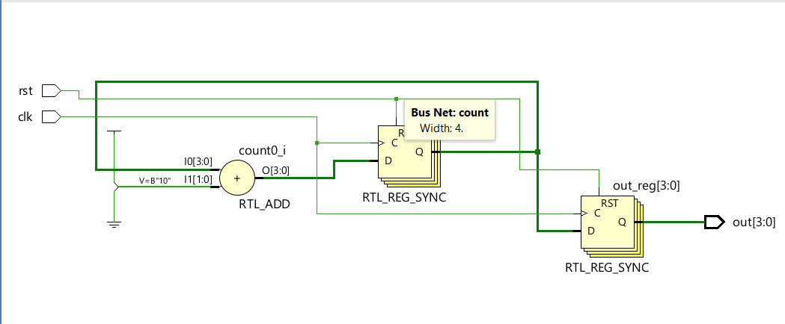
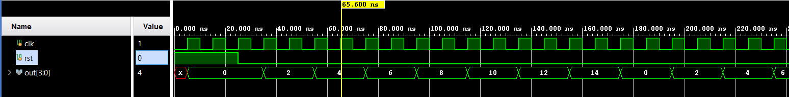

# 📘 Verilog 100 Days – Waveform and Explanation Gallery

This document shows the waveform results and brief explanations of EVEN COUNTER

---

## ✅ Day 70 - EVEN COUNTER

**Description:**  
  the scematic of  EVEN COUNTER 
count <= count + 2'd2; 
out <= count; 

**Description:**  
simulation results.
simualtion results of  EVEN COUNTER 
if(count[0] == 1)begin 
out <= count; 
end 

 
### 🔬 Simulation Result

**Description:**  
simulation results.
simualtion results of EVEN COUNTER
