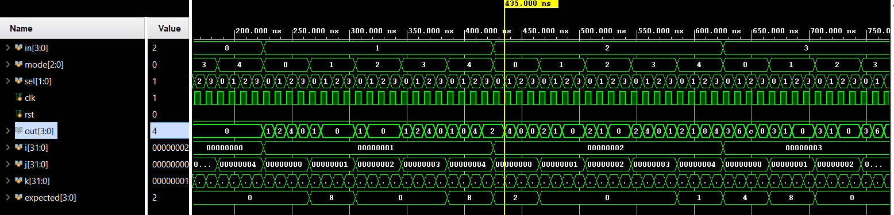

# 📘 Verilog 100 Days – Waveform and Explanation Gallery

This document shows the waveform results and brief explanations of EVEN COUNTER

---

## ✅ Day 70 - barrel shifter checking with test bench to check dut
 

 

 
### 🔬 Simulation Result

**Description:**  
simulation results.
simualtion results of EVEN COUNTER

