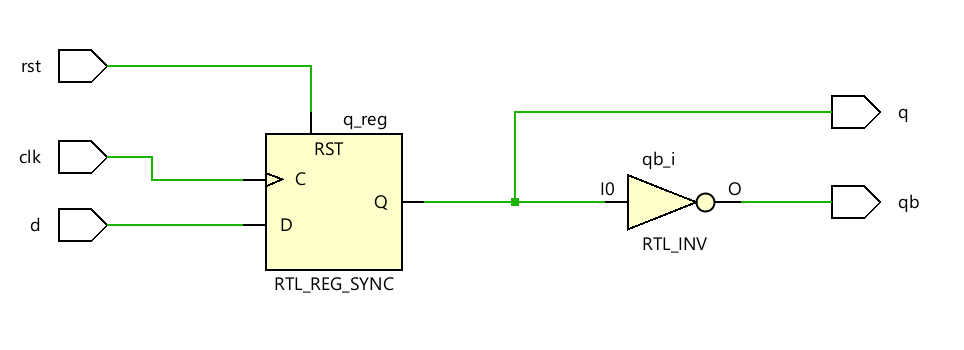
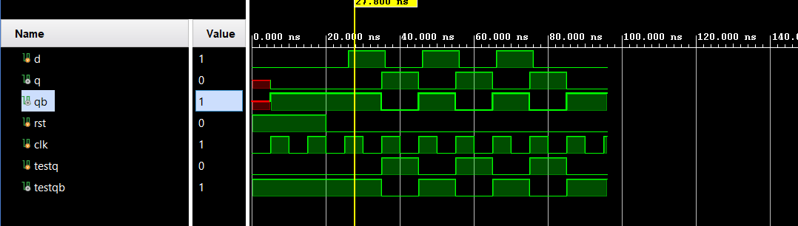

# 📘 Verilog 100 Days – Waveform and Explanation Gallery

This document shows the waveform results and brief explanations of d_ff checking with test bench to check dut

---

## ✅ Day 70 - d_ff checking with test bench to check dut

 

**Description:**  
# run 1000ns 
Time	D	RST	Expected Q	Actual Q 
                   0	0	1	0		x 
Mismatch detected at time 5 
  Expected Q: 0, Actual Q: x 
                   5	0	1	0		0 
                  20	0	0	0		0 
                  26	1	0	0		0 
                  35	1	0	1		1 
                  36	0	0	1		1 
                  45	0	0	0		0 
                  46	1	0	0		0 
                  55	1	0	1		1 
                  56	0	0	1		1 
                  65	0	0	0		0 
                  66	1	0	0		0 
                  75	1	0	1		1 
                  76	0	0	1		1 
                  85	0	0	0		0 
 

 
### 🔬 Simulation Result

**Description:**  
simulation results.
simualtion results of EVEN COUNTER
