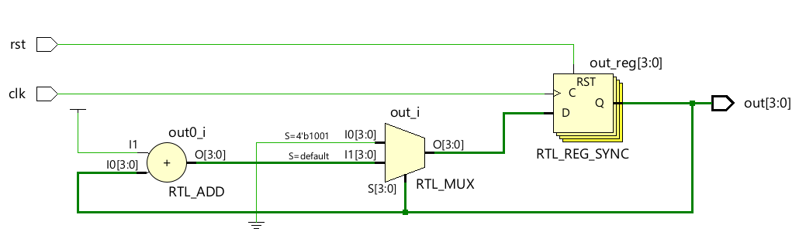

# 📘 Verilog 100 Days – Waveform and Explanation Gallery

This document shows the waveform results and brief explanations of mod_10counter_tbfunction

---

## ✅ Day 70 - mod_10counter_tbfunction

 

**Description:**  
 run 1000ns
 1 |  0  
 2 |  1   
 3 |  2   
 4 |  3  
 5 |  4  
 0 |  5  
 1 |  0  
 2 |  1  
 3 |  2  
 4 |  3  
 5 |  4  
 6 |  5  
 7 |  6  
 8 |  7  
 9 |  8  
 0 |  9  
 1 |  0  
 2 |  1  
 3 |  2  
 4 |  3  
 5 |  4  
 6 |  5  
 7 |  6  
 8 |  7  
 9 |  8  
 0 |  9  
 1 |  0  
 2 |  1  
 3 |  2  
 4 |  3  
 5 |  4  
 6 |  5  
 7 |  6  
 8 |  7  
 9 |  8  
 0 |  9  
 1 |  0  
 2 |  1  
 3 |  2  
 4 |  3  
 5 |  4  
 6 |  5  
 7 |  6  
 8 |  7  
 9 |  8  
 0 |  9  
 1 |  0  
 2 |  1  
 3 |  2  
 4 |  3  
 5 |  4  
 6 |  5  
 7 |  6  
 8 |  7  
 9 |  8  
 0 |  9  
 1 |  0  
 2 |  1  
 3 |  2  
 4 |  3  
 5 |  4  
 6 |  5  
 7 |  6  
 8 |  7  
 9 |  8  
 0 |  9  
 1 |  0  
 2 |  1  
 3 |  2  
 4 |  3  
 5 |  4  
 6 |  5  
 7 |  6  
 8 |  7  
 9 |  8  
 0 |  9  
 1 |  0  
 2 |  1  
 3 |  2  
 4 |  3  
 5 |  4  
 6 |  5  
 7 |  6  
  

 
### 🔬 Simulation Result

**Description:**  
simulation results.
simualtion results of mod_10counter_tbfunction
