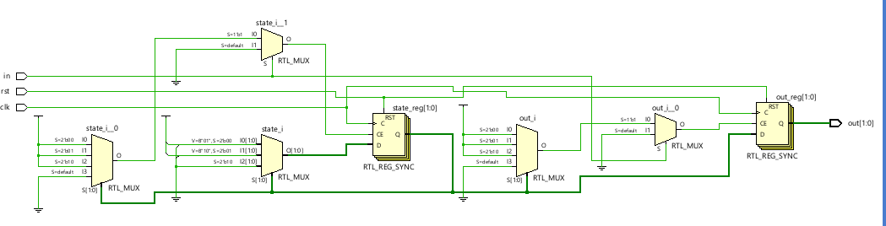
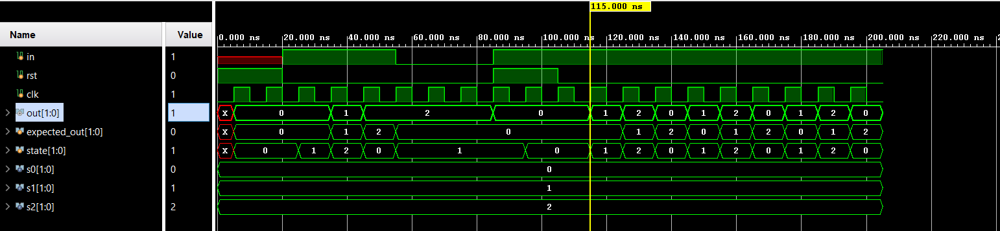

# 📘 Verilog 100 Days – Waveform and Explanation Gallery

This document shows the waveform results and brief explanations of threestatefsm

---

## ✅ Day 74 - threestatefsm

 

**Description:**  
# run 1000ns
2 | 0   
2 | 0  
2 | 0  
1 | 0  
2 | 1  
0 | 2  
1 | 0  
2 | 1  
0 | 2  
1 | 0  
2 | 1  

 
### 🔬 Simulation Result

**Description:**  
simulation results.
simualtion results of threestatefsm
