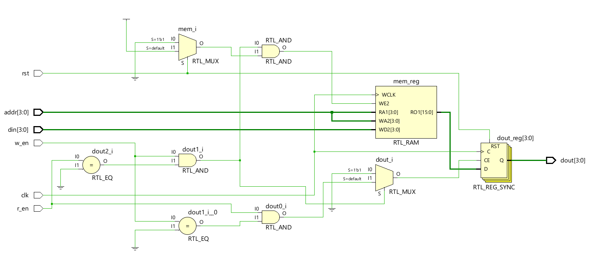
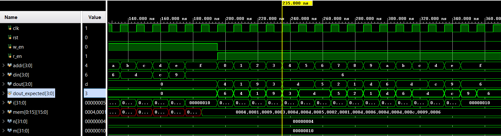

# 📘 Verilog 100 Days – Waveform and Explanation Gallery

This document shows the waveform results and brief explanations of single_port_ram

---

## ✅ Day 75 - single_port_ram

 

**Description:**  
 # run 1000ns
 4 |  6  
 1 |  4  
 9 |  1  
 3 |  9  
13 |  3  
 5 | 13  
 2 |  5  
 1 |  2  
13 |  1  
 6 | 13  
13 |  6  
12 | 13  
 9 | 12  
 6 |  9   
 
### 🔬 Simulation Result

**Description:**  
simulation results.
simualtion results of single_port_ram
