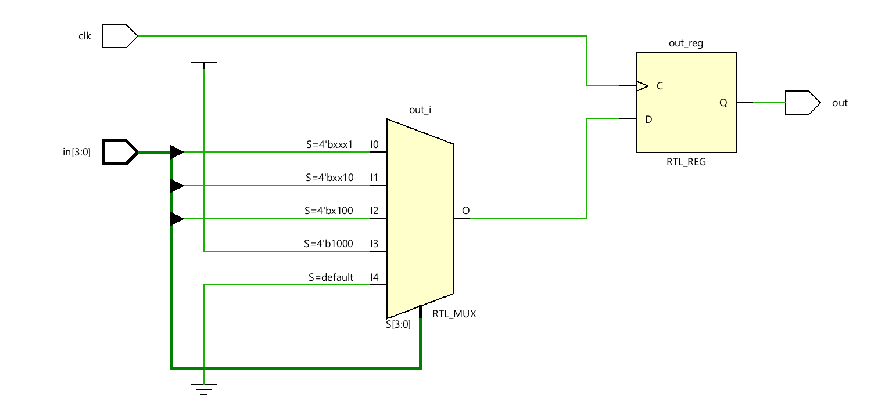
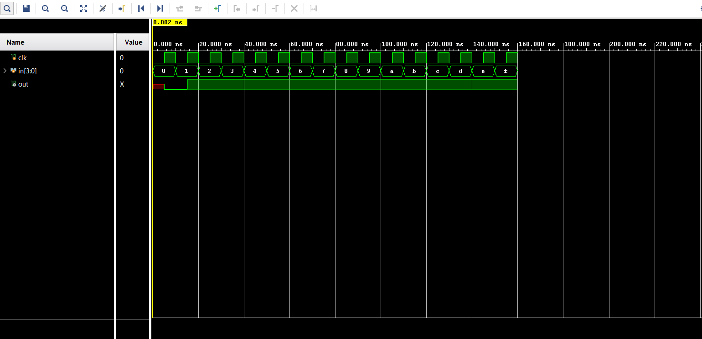
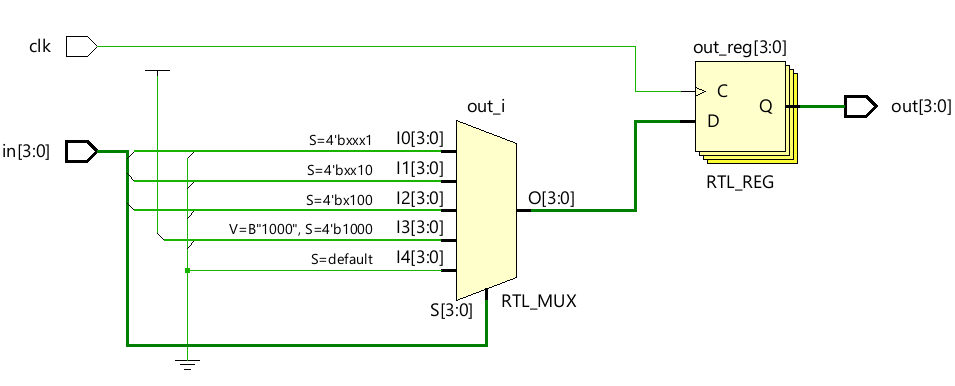
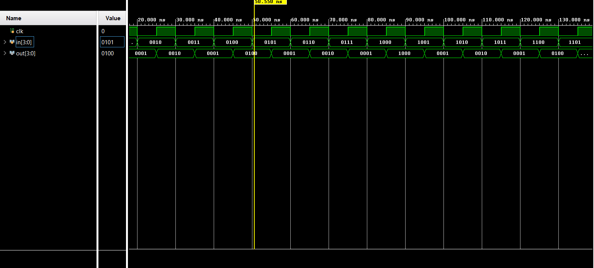

# 📘 Verilog 100 Days – Waveform and Explanation Gallery

This document shows the waveform results and brief explanations of priority mux.

---

## ✅ Day 08 - priority mux

 

**Description:**  
  the scematic of priority mux with one-bit output

### 🔬 Simulation Result

**Description:**  
simulation results.
simualtion results of priority mux with one-bit output

###  full Modeling

**Description:** 
   the scematic of priority mux with 4-bit output

  ### 🔬 Simulation Result

**Description:**  
simulation results.
simualtion results of priority mux with 4-bit output
