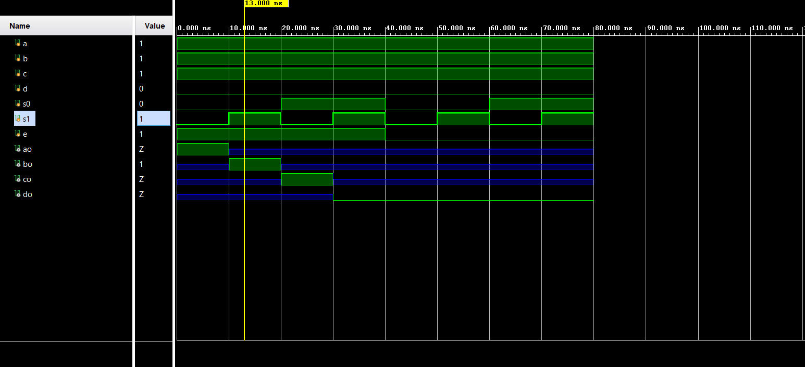

# 📘 Verilog 100 Days – Waveform and Explanation Gallery

This document shows the waveform results and brief explanations of  tristate using mux for reference image.

---

## ✅ Day 09 - tristate using mux for reference image.

 

**Description:**  
the image is from google and synthesize this design in verilog and simulate it in vivado.

**Description:**  
  the scematic of  tristate buffer with mux

 

### 🔬 Simulation Result

**Description:**  
simulation results.
simualtion results of  tristate buffer with mux
